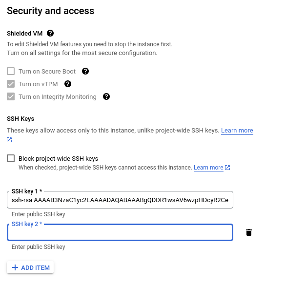
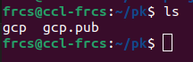
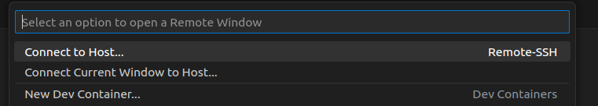
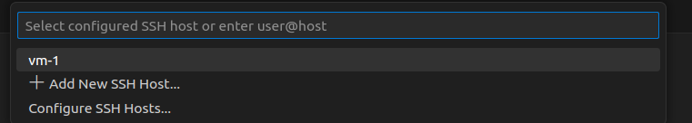

# Cloud-Powered Development: GCP VMs with VS Code

Cloud computing has revolutionized the way businesses and individuals access and manage data and applications. Its usage is skyrocketing as it offers scalability, cost-efficiency, and accessibility, empowering organizations to adapt quickly to changing demands, foster innovation, and drive digital transformation. With each passing day, more industries and individuals are harnessing the cloud's power to stay competitive and agile in an increasingly digital world.  
Though cloud computing offers powerful capabilites the user interface for services like the Compute Engine can be complex, especially for users who are new to cloud computing.  
Today, let's explore the [Remote-SSH](https://code.visualstudio.com/docs/remote/ssh) extension for Visual Studio Code. It's a nifty tool that brings your cloud VMs right into your coding environment, making cloud development a breeze. Say hello to a more efficient and user-friendly coding experience!

Following image(collected) illustrates how the Remote-SSH extension effortlessly connects your local coding setup to remote cloud servers, making it easier than ever to work on cloud-based projects.    

Establishing a connection to a VM requires SSH keys. If you don't already have SSH keys associated with a VM, you can create and add them quickly in just a few minutes.

### Adding SSH Key in a existing VM
To set up SSH keys for a VM, follow these steps.
- Create a new SSH keypair using `ssh-keygen`. This will generate both a private and a public key.
```
ssh-keygen -C "USERNAME" -f /path/to/your/username_key
```
-C flag adds the username as a comment in the keypair, which will be needed to establish connection.  
-f flag defines the filepath to store the keypair in your system.

- Add the public key to the VM's configuration.
In the Google Cloud Console, navigate to `Compute Engine` and select `VM Instances`. From there, choose the specific VM to which you want to add an SSH key. Now, add the ssh public key and save it.


- Use the private key for establishing a secure connection with the VM.

### Install Remote-SSH in VsCode
In your vs code, search for the "Remote-SSH" extension and proceed to install it.

### Add SSH information in config 
You need to add your ssh information in the config file to access it from the vscode.
`nano ~/.ssh/config`  

```
Host add_any_name
    HostName XX.XX.XX.XX
    User username
    IdentityFile path_to_the_private_key
```
You have flexibility in choosing a name for the "Host." For the "Hostname," use the public IP of your VM. In the "User" field, specify the username you used when creating the SSH keypair with the `-C` flag. Lastly, in the "IdentityFile" field, provide the path to your SSH private key. If you've named your SSH key pair "gcp," the public key is "gcp.pub," and the private key is "gcp." This setup will allow you to establish an SSH connection to your VM.  
You can check the key values using cat command.  




### Open VM in VSCode
To connect to your VM using VS Code's Remote Explorer, follow these steps:

- Open VS Code and navigate to the Remote Explorer.
- Select "Connect to Host."  

    
- You'll find your VM listed with the host you provided. Click on it.  

    
- VS Code will open a new window with your VM, allowing you to work directly on your VM from within VS Code.

This setup streamlines your development process, enabling you to seamlessly work on your VM using the familiar VS Code environment.


