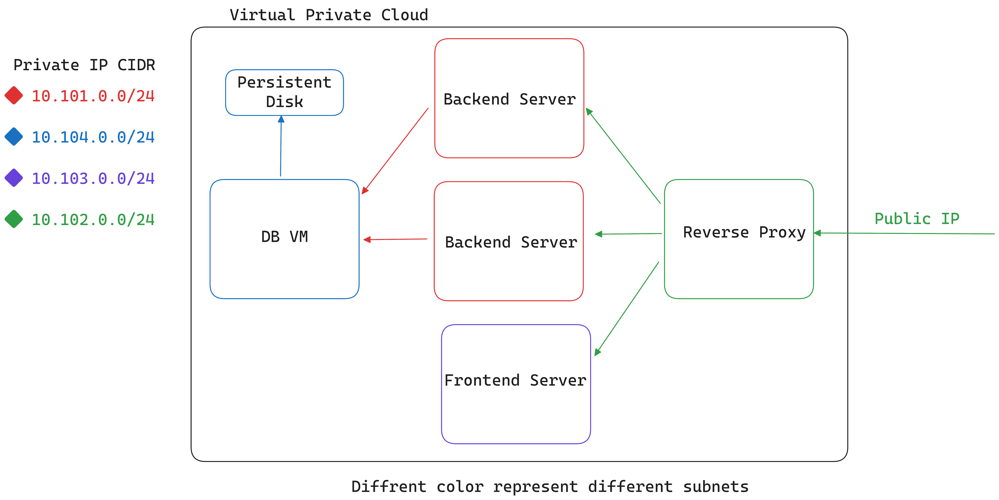
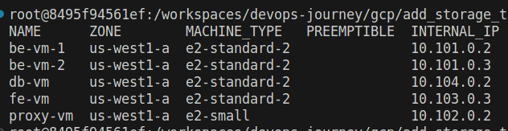
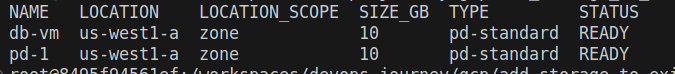
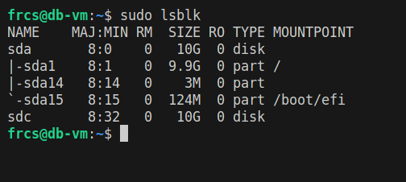
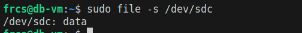
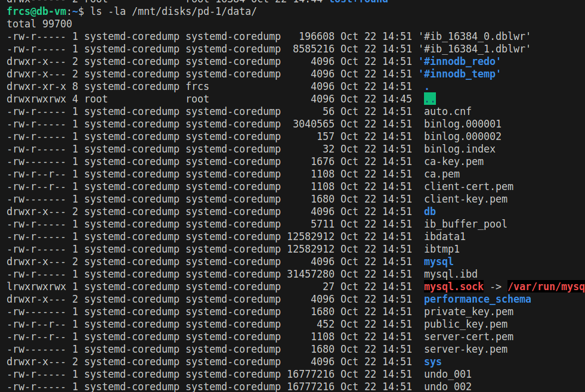

## Add persistant disk in an existing GCP VM

In our previous setup, we had an architecture in place that did not include a persistent disk. Now, we're enhancing that existing architecture by introducing a persistent disk to accompany the database instance. This addition ensures that our data is stored securely on a separate disk, and it allows us to recover our data in case of a virtual machine failure. 



To initiate the process, kindly refer to the instructions given earlier for accessing the Development Container. You can find those instructions by visiting the provided [link](https://medium.com/@frcshovon/effortless-full-stack-deployment-on-google-cloud-platform-gcp-51a0f95aff07) for the previous setup.

### GCP Extended Makefile

```
# GCP Extended Makefile

# List existing VM instances
gcloud_instance_list:
	@ gcloud compute instances list

# Variables for persistent disk
PD_NAME := pd-1
PD_TYPE := pd-standard
PD_SIZE := 10GB
PD_ZONE := us-west1-a
PD_POLICY := projects/${PROJECT_ID}/regions/us-west1/resourcePolicies/default-schedule-1

# Create a persistent disk
gcloud_create_persistent_disk:
	@ gcloud compute disks create $(PD_NAME) \
		--project=$(PROJECT_ID) \
		--type=$(PD_TYPE) \
		--size=$(PD_SIZE) \
		--resource-policies=$(PD_POLICY) \
		--zone=$(PD_ZONE)

# Attach persistent disk to VM instance
gcloud_attach_persistent_disk:
	@ gcloud compute instances attach-disk $(INSTANCE_NAME) \
		--disk $(PD_NAME)

# Check which VM instances are using the persistent disk
gcloud_check_persistent_disk_user:
	@ gcloud compute disks list --filter="users:$(INSTANCE_NAME)"

# Main target for creating and attaching the persistent disk
setup_persistent_disk: gcloud_create_persistent_disk gcloud_attach_persistent_disk
```
This is the extended version of the makefile from the previous setup.

### Build the extended infrastructure in GCP according to the architecture

- **Login into GCP accout**
    ```
    make gcloud_login
    ```
- **Set Project from the GCP account**  
    ```
    make gcloud_set
    ```
- **Create a persistent disk**
    ```
    make gcloud_create_persistent_disk
    ```
    This action will create persistent disk with a size of 10GB and a standard disk type. You have the flexibility to customize these options based on your specific needs.
- **Check existing VM instances list** 
    ```
    make gcloud_instance_list
    ```
    
    This command will display a list of the VM instances that are currently available in our project. We will use this information to select the VM instance to which we want to attach the newly created persistent disk. As per our architecture, we intend to attach this disk to the database instance.
- **Attach persistent disk with VM instance**
    ```
    make gcloud_attach_persistent_disk
    ```
    This action will attach the persistent disk to the database instance. You can verify the attachment by using the following command.
- **Verify Persistent Disk Attachment**
    ```
    make gcloud_check_persistent_disk_user
    ```
    

The initial phase of our setup is complete. Let's proceed to the second phase.  

The newly created and attached disks are in an unformatted state. Before they can be used, it's essential to format and mount the disks. For detailed information, please refer to the Google Cloud Platform (GCP) documentation.

### Configure persistent disk
Accessing the database instance directly isn't possible since it does not possess a public IP address. Therefore, we need to utilize our proxy instance as a jump server to gain access to the database instance. You can check [this link](https://medium.com/@frcshovon/cloud-powered-development-gcp-vms-with-vs-code-519f3ee9d0ff) out if you need any assistance regarding following process.

```
ssh -i path_to_your_private_key   proxy_vm_username@proxy_vm_public_ip
```
To access the database VM, we will need to SSH once more from the proxy VM.
```
ssh -i path_to_your_private_key db_vm_username@db_vm_private_ip
```
We have successfully entered the database VM. Similar to our previous setup, we will utilize Docker to run a MySQL container. However, this time, we will also bind the persistent disk volume to the MySQL container. But first we need to configure the persistent disk.
```
sudo lsblk
```

We can observe that our 10GB disk is present, but it currently lacks a mount point. Let's examine whether it has a valid file system in place.
```
sudo file -s /dev/sdb
```

If the output is simply *data*, it typically means that the command couldn't determine the specific file system or content type of the block device */dev/sdb*. We have to create a file system.  
```
 sudo mkfs.ext4 -m 0 -E lazy_itable_init=0,lazy_journal_init=0,discard /dev/sdb 
```

Now, when you use the *file -s* command, it displays a recognized file system. To use this disk with the database instance, you should proceed to mount it.
```
sudo mkdir -p /mnt/disks/pd-1
```
Here, pd-1 is the directory where we'll mount the disk. You can use any directory of your device. Now, we will mount the disk and add read write permission on that disk.
```
sudo mount -o discard,defaults /dev/sdb /mnt/disks/pd-1
sudo chmod a+w /mnt/disks/pd-1
```
The persistent disk is successfully attached to the database instance. Now, you can proceed to mount the Docker volume on the persistent storage, which will ensure secure data storage in case of failures or outages.  

A simple docker compose file will contain following configuration which will mount the docker container mysql storage in the persistant disk storage. Create a directory named *data* in */mnt/disks/pd-1* using following command. 
```
mkdir -p /mnt/disks/pd-1/data
``` 

```
version: '3.8'

services:
  mysql:
    image: mysql:latest
    container_name: my-mysql-container
    environment:
      MYSQL_ROOT_PASSWORD: your_root_password
      MYSQL_DATABASE: your_database_name
      MYSQL_USER: your_user
      MYSQL_PASSWORD: your_password
    volumes:
      - ~/mnt/disks/pd-1/data:/var/lib/mysql
    ports:
      - "3306:3306"

```


We've achieved our objective of attaching a persistent volume at a private VM instance running at GCP.