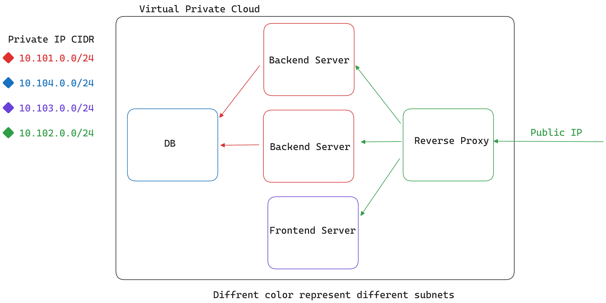

# Effortless Full Stack Deployment on GCP
Our primary objective is to deploy a full-stack application to GCP while adhering to a particular architecture. The illustration below depicts the architecture.  


We have divided our component into four sections based on its architecture. Each component will have its own subnet and will be isolated from the others unless permission is granted. The backend component will include two instances operating in a subnet.
- **Reverse Proxy:** The reverse proxy will have a public IP address that users can use to communicate with different components. Using the reverse proxy, a user can make requests to both the backend and the frontend. The reverse proxy will also act as a load balancer, splitting incoming requests for the backend across two servers using round-robin algorithm.  
- **Backend** The backend server will have two instances and deployed in the same subnet. The backend will only accept incoming requests on a certain port from the reverse proxy and only backend can access the database server.
- **Frontend** The frontend server will accept incoming requests on a certain port from the reverse proxy. It has no direct access to the backend or database.
- **Database** This is a crucial component of the architecture and it is secured by restricting the direct access from other components and the public users. The database only accept request from the backend.  
Let's begin...

### Dev Container
We'll simplify the process by utilizing development containers, also known as *dev containers*. Development containers or dev containers, are Docker containers that are specifically configured to provide a fully featured development environment. To begin, let's make a directory, then a docker file, and finally a devcontainer json file in that.  The Dockerfile should include the following content.
```
FROM ubuntu:22.04

RUN apt-get update && \
    apt-get install -y apt-transport-https ca-certificates gnupg curl sudo make ssh

RUN echo "deb https://packages.cloud.google.com/apt cloud-sdk main" | sudo tee -a /etc/apt/sources.list.d/google-cloud-sdk.list \
    && curl https://packages.cloud.google.com/apt/doc/apt-key.gpg | sudo apt-key add - \
    && apt-get update \
    && apt-get install -y google-cloud-sdk

WORKDIR /gcp-automation
COPY . /gcp-automation
```
And the devcontainer.json will have the following content.
```
{
  "name": "GCP Full Stack deploy Dev-Container",
  "dockerFile": "Dockerfile",
  "settings": {
    "terminal.integrated.shell.linux": "/bin/bash"
  },
  "extensions": [],
  "remoteUser": ""
}
```
Go ahead and launch this container in VSCode. Docker container will launch with all required packages pre-installed.  
Now an auth file is needed to access your gcp account from this container using google cloud cli. Follow [this link](https://cloud.google.com/iam/docs/keys-create-delete#iam-service-account-keys-create-gcloud) to create a service account auth file and you will get a json like auth.sample.json. Store those information in a file named auth.json . Now, we are ready to start the deployment process.

### GCP makefile
After starting the container, we have already gcloud cli installed in it. Let's create a makefile. We invoke the targets from the makefile.
```
KEY_FILE:=auth.json
PROJECT_ID:=charged-shuttle-397417

# Login into gcp
gcloud_login:
	@ gcloud auth activate-service-account --key-file=${KEY_FILE}

# Selecting project available from your account
gcloud_set:
	@ gcloud config set project ${PROJECT_ID}

# VPC
VPC:= my-vpc
SUBNET_MODE:= custom

# create vpc
gcloud_create_vpc:
	@ gcloud compute networks create ${VPC} --subnet-mode=${SUBNET_MODE}

# SUBNET
PROXY_SUBNET:=s-3
PROXY_SUBNET_CIDR:=10.102.0.0/24

BE_SUBNET=backend-subnet
BE_SUBNET_CIDR:=10.101.0.0/24

FE_SUBNET=frontend-subnet
FE_SUBNET_CIDR:=10.103.0.0/24

DB_SUBNET=db-subnet
DB_SUBNET_CIDR:=10.104.0.0/24

REGION:=us-west1
ZONE:=us-west1-a

# Create subnet Proxy
gcloud_create_subnet_proxy:
	@ gcloud compute networks subnets create ${PROXY_SUBNET} --network=${VPC} --range=${PROXY_SUBNET_CIDR} --region=${REGION}

# Create subnet backend
gcloud_create_subnet_be:
	@ gcloud compute networks subnets create ${BE_SUBNET} --network=${VPC} --range=${BE_SUBNET_CIDR} --region=${REGION}

# Create subnet frontend
gcloud_create_subnet_fe:
	@ gcloud compute networks subnets create ${FE_SUBNET} --network=${VPC} --range=${FE_SUBNET_CIDR} --region=${REGION}

#Create subnet database
gcloud_create_subnet_db:
	@ gcloud compute networks subnets create ${DB_SUBNET} --network=${VPC} --range=${DB_SUBNET_CIDR} --region=${REGION}

# Create all subnet
gcloud_create_subnet_all: gcloud_create_subnet_proxy gcloud_create_subnet_be gcloud_create_subnet_fe gcloud_create_subnet_db

# Create VM Instances
MACHINE_TYPE:=e2-standard-2
PUB_KEY_CONTENT := $(shell cat devcon.pub)
USERNAME:=user

# Create vm instance for proxy server
PROXY_INSTANCE:=proxy-vm
PROXY_TAG:=proxy
gcloud_create_proxy_vm:
	@ gcloud compute instances create ${PROXY_INSTANCE} \
		--project=${PROJECT_ID} \
    	--machine-type=${MACHINE_TYPE} \
		--image-family=debian-10 \
		--image-project=debian-cloud \
		--boot-disk-size=10GB \
		--subnet=${PROXY_SUBNET} \
		--zone=${ZONE} \
		--metadata="ssh-keys=${USERNAME}:${PUB_KEY_CONTENT}"  \
		--network=${VPC} \
		--tags=${PROXY_TAG} 

# Create vm instance for backend-1
BE_INSTANCE_1:=be-vm-1
BE_TAG:=be
gcloud_create_backend_vm_1:
	@ gcloud compute instances create ${BE_INSTANCE_1} \
		--project=${PROJECT_ID} \
    	--machine-type=${MACHINE_TYPE} \
		--image-family=debian-10 \
		--image-project=debian-cloud \
		--boot-disk-size=10GB \
		--subnet=${BE_SUBNET} \
		--zone=${ZONE} \
		--metadata="ssh-keys=frcs:${PUB_KEY_CONTENT}"  \
		--network=${VPC} \
		--tags=${BE_TAG} \
		--no-address 

# Create vm instance for backend-2
BE_INSTANCE_2:=be-vm-2
BE_TAG:=be
gcloud_create_backend_vm_2:
	@ gcloud compute instances create ${BE_INSTANCE_2} \
		--project=${PROJECT_ID} \
    	--machine-type=${MACHINE_TYPE} \
		--image-family=debian-10 \
		--image-project=debian-cloud \
		--boot-disk-size=10GB \
		--subnet=${BE_SUBNET} \
		--zone=${ZONE} \
		--metadata="ssh-keys=frcs:${PUB_KEY_CONTENT}"  \
		--network=${VPC} \
		--tags=${BE_TAG} \
		--no-address 

# Create vm for database
DB_INSTANCE:=db-vm
DB_TAG:=db
gcloud_create_database_vm:
	@ gcloud compute instances create ${DB_INSTANCE} \
		--project=${PROJECT_ID} \
    	--machine-type=${MACHINE_TYPE} \
		--image-family=debian-10 \
		--image-project=debian-cloud \
		--boot-disk-size=10GB \
		--subnet=${DB_SUBNET} \
		--zone=${ZONE} \
		--metadata="ssh-keys=frcs:${PUB_KEY_CONTENT}"  \
		--network=${VPC} \
		--tags=${DB_TAG} \
		--no-address 

# Create vm for front-end
FE_INSTANCE:=fe-vm
FE_TAG:=fe
gcloud_create_frontend_vm:
	@ gcloud compute instances create ${FE_INSTANCE} \
		--project=${PROJECT_ID} \
    	--machine-type=${MACHINE_TYPE} \
		--image-family=debian-10 \
		--image-project=debian-cloud \
		--boot-disk-size=10GB \
		--subnet=${FE_SUBNET} \
		--zone=${ZONE} \
		--metadata="ssh-keys=frcs:${PUB_KEY_CONTENT}"  \
		--network=${VPC} \
		--tags=${FE_TAG} \
		--no-address 	

# CLOUD ROUTER
ROUTER_NAME:=my-router
gcloud_create_router:
	@ gcloud compute routers create ${ROUTER_NAME} --region=${REGION} --network=${VPC}
# CLOUD NAT
NAT_NAME:=my-nat
gcloud_create_nat:
	@ gcloud compute routers nats create ${NAT_NAME} \
		--router=${ROUTER_NAME} \
		--region=${REGION} \
		--nat-all-subnet-ip-ranges \
		--auto-allocate-nat-external-ips

# IAP allow ingress Firewall rule
gcloud_allow_rdp_ingress_3389:
	@ gcloud compute firewall-rules create allow-rdp-ingress-from-iap \
		--direction=INGRESS \
		--action=allow \
		--rules=tcp:3389 \
		--source-ranges=35.235.240.0/20 \
		--target-tags=${BE_TAG},${FE_TAG},${DB_TAG}

# Allow SSH on all VMs
gcloud_allow_ssh_ingress_22:
	@ gcloud compute firewall-rules create allow-ssh-ingress-from-iap \
		--direction=INGRESS \
		--action=allow \
		--rules=tcp:22 \
		--source-ranges=35.235.240.0/20 \
		--target-tags=${BE_TAG},${FE_TAG},${DB_TAG}

# Allow Ingress on DB VM Port 3306 from the Backends
gcloud_allow_ingress_on_DB_port_3306_from_backends:
	@ gcloud compute firewall-rules create allow-ingress-db-from-backends \
		--direction=INGRESS \
		--action=allow \
		--rules=tcp:3306 \
		--source-ranges=${BE_SUBNET_CIDR} \
		--target-tags=${DB_TAG} \
		--network=${VPC}

# Allow Ingress on Frontend and Backend VM Port 3000 from the Proxy server
gcloud_allow_ingress_on_FE_BE_port_3000_from_proxy_subnet:
	@ gcloud compute firewall-rules create allow-ingress-fe-from-proxy-subnet \
		--direction=INGRESS \
		--action=allow \
		--rules=tcp:3000 \
		--source-ranges=${PROXY_SUBNET_CIDR} \
		--target-tags=${FE_TAG},${BE_TAG} \
		--network=${VPC}

# Allow Ingress from all IP on Proxy VM
ANY_IP:=0.0.0.0/0
gcloud_allow_ingress_on_PROXY_VM_port_80_http_from_all:
	@ gcloud compute firewall-rules create allow-ingress-proxy-vm-port-80-http-from-all \
		--direction=INGRESS \
		--action=allow \
		--rules=tcp:80 \
		--source-ranges=${ANY_IP} \
		--target-tags=${PROXY_TAG} \
		--network=${VPC}

gcloud_allow_ingress_on_PROXY_VM_port_443_https_from_all:
	@ gcloud compute firewall-rules create allow-ingress-proxy-vm-port-443-http-from-all \
		--direction=INGRESS \
		--action=allow \
		--rules=tcp:80 \
		--source-ranges=${ANY_IP} \
		--target-tags=${PROXY_TAG} \
		--network=${VPC}

# Execute all firewall rules mentioed previously using one call
create_firewall_rules:
	@ $(MAKE) gcloud_allow_ingress_3389
	@ $(MAKE) gcloud_allow_ingress_22
	@ $(MAKE) gcloud_allow_ingress_on_DB_port_3306_from_backends
	@ $(MAKE) gcloud_allow_ingress_on_FE_BE_port_3000_from_proxy_subnet
	@ $(MAKE) gcloud_allow_ingress_on_PROXY_VM_port_80_http_from_all
	@ $(MAKE) gcloud_allow_ingress_on_PROXY_VM_port_443_https_from_all
```
This is the complete content of the makefile.  

### Build the infrastructure in GCP according to the architecture
Set the auth.json file path in the makefile's *KEY_FILE* macro. We must additionally set *PROJECT_ID*, we can get the value from auth.json. Let's start invoking the targets one by one.

- **Login into the GCP account**
    ```
    make gcloud_login
    ```
- **Set Project from the GCP account**
    ```
    make gcloud_set
    ```
- **Create a VPC**
    ```
    make gcloud_create_vpc
    ```
    This will create a vpc with subnet mode *custom*.

Next, we will establish four distinct subnet within the existing Virtual Private Cloud (VPC). 
- **Create subnets into the VPC**  
	There are two options to create subnets.
    ```
    make gcloud_create_subnet_all
    ```
    This will create four subnet together. Or we can manually create subnets one by one.  
    Ignore the following commands if you have executed previous command.
    
    ```
    make gcloud_create_subnet_proxy
    make gcloud_create_subnet_be
    make gcloud_create_subnet_fe
    make gcloud_create_subnet_db
    ```
    We've now successfully created four subnetworks, each with its own unique IP CIDR range.
    - **Proxy Subnet** 10.102.0.0/24
    - **Backend Subnet** 10.101.0.0/24
    - **Frontend Subnet** 10.103.0.0/24
    - **DB Subnet** 10.104.0.0/24

Next, our task is to create virtual machines (VMs) within the newly created subnets.
- **Create VM into the subnets**  
	Before creating the VMs, let's create a ssh key pair. We can use ssh-keygen to create a keypair. Store the public key named devcon.pub in the same directory of the makefile. It will automatically set the SSH key in each VM. Also set the *USERNAME* macro in the makefile. We will use *e2-standard-2* machine type in each vm which comes with 2 vCPUs and 8GB memory. You have the flexibility to set the machine type according to your specific requirements.
    ```
    make gcloud_create_proxy_vm
    make gcloud_create_backend_vm_1
    make gcloud_create_backend_vm_2
    make gcloud_create_database_vm
    make gcloud_create_frontend_vm
    ```
    We're implementing explicit network tags for each VM, which will enable us to apply specific firewall rules effectively.  

We've successfully created five VMs, with only the proxy VM having a public IP address, allowing external access to it while the others remain within the network.  

To enable internet access for the private VMs without public IP addresses, we'll need to set up Cloud NAT (Network Address Translation) and configure Cloud Router. This will allow the private VMs to access the internet through a NAT gateway.
- **Create Cloud Router and Cloud NAT**
    ```
    make gcloud_create_router
    make gcloud_create_nat
    ```
    This will create a Cloud Router and Cloud NAT, integrated with our VPC, enabling internet access for the private VMs without the need for public IPs.

Now, we should configure the relevant firewall rules on each virtual machine.

- **Enable SSH ingress (port 22) on all VMs**
    ```
    make gcloud_allow_ssh_ingress_22
    ```
- **Enable ingress from Backends to DB (port 3306)**
    ```
    make gcloud_allow_ingress_on_DB_port_3306_from_backends
    ```
- **Enable ingress from Proxy to Frontend and Backend (port 3000)**
    ```
    make gcloud_allow_ingress_on_FE_BE_port_3000_from_proxy_subnet
    ```
- **Enable ingress from Internet to Proxy (port 80)**
    ```
    make gcloud_allow_ingress_on_PROXY_VM_port_80_http_from_all
    ```
Our GCP infrastructure is nearly complete. Now, it's time to deploy the servers onto the VMs.

### Configure Proxy VM 

You can follow [this link](https://medium.com/@frcshovon/cloud-powered-development-gcp-vms-with-vs-code-519f3ee9d0ff) to setup a VM with public ip into VSCode and start development using the VSCode. This will streamline the development process.  
For this particular virtual machine, we must set up *Nginx* to function as both a reverse proxy and a load balancer.  
Follow [Nginx](https://www.nginx.com/blog/setting-up-nginx/) official document for installation. Visiting the public IP in any web browser will display a simple HTML template served by Nginx.  
Now go to */etc/nginx/* and modify the nginx.conf file.
```
user www-data;
worker_processes auto;
pid /run/nginx.pid;
include /etc/nginx/modules-enabled/*.conf;

events {
        worker_connections 768;
}

http {

        sendfile on;
        tcp_nopush on;
        types_hash_max_size 2048;
        include /etc/nginx/mime.types;
        default_type application/octet-stream;

        ssl_protocols TLSv1 TLSv1.1 TLSv1.2 TLSv1.3; # Dropping SSLv3, ref: POODLE
        ssl_prefer_server_ciphers on;

        access_log /var/log/nginx/access.log;
        error_log /var/log/nginx/error.log;

        gzip on;

       
        include /etc/nginx/conf.d/*.conf;
        include /etc/nginx/sites-enabled/*;

upstream backend_servers {
        server 10.101.0.2:3000;
        server 10.101.0.3:3000;
    }
upstream frontend_server{
        server 10.103.0.3:3000;
}
    server {
        listen 80;
        server_name 34.105.24.199 ;
location / {
            # Proxy requests to frontend_server upstream
            proxy_pass http://frontend_server;
        }

        location /api/ {
            # Proxy requests to backend_server upstream
        rewrite ^/api(/.*)$ $1 break;
            proxy_pass http://backend_servers;
        }
    }
}

```
Here is my Nginx configuration file. Please exercise caution when adjusting the IP addresses for the frontend and backend servers to match your specific GCP infrastructure.  
Now, verify the validity of the Nginx configuration, and subsequently, restart Nginx to apply the changes.
```
sudo nginx -t 
sudo nginx -s reload
```

### Configure Backend VMs
Since these VMs don't have public access, direct SSH connections aren't possible. We can either utilize a Proxy VM as a jump server or leverage Google Cloud Platform's IAP for browser-based SSH access to these VMs. This applies to the frontend VM as well.  

I am going to deploy [this](https://github.com/Sshovon/gcp_full_stack_app.git) repository as a full stack application. The backend includes two POST routes: the first one accepts an email in the request body to generate an OTP and stores it in the database. The second route takes an email and OTP for OTP verification against the database.
```
{Your Proxy VM IP}/api/generate-otp
{Your Proxy VM Ip}/api/verify-otp
```
The entire project is containerized with Docker. You'll need to install Docker and Make in your VM. Afterward, refer to the makefile to initiate the project.

**Follow similar procedure for the second backed server**

### Configure Database VM
I've simplified the solution by using Dockerized MySQL as the database. Follow the same process as setting up the backend server to configure the VM. Additionally, refer to the database's makefile to initiate the MySQL container

### Configure Frontend VM
Follow the same process as setting up the backend server to configure the VM. Additionally, check the frontend directory makefile to initiate the project.


Everything is now set up. If you access the proxy IP from a web browser, it will automatically redirect you to the frontend server. Similarly, when an API request is made, it will be redirected to the appropriate backend server.