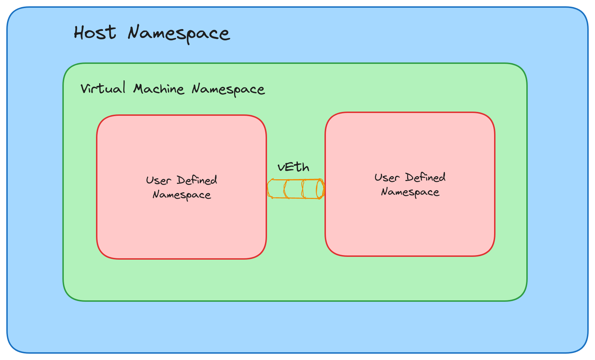

# Objective
Today our objective is create two isolated network namespace in a virutal machine and connect them using a virtual ethernet cable. Following figure will dipict our goal.


## Network namespace
A network namespace is a feature in Linux operating systems that allows the creation of isolated network environments. It is a mechanism that partitions the network stack, including network interfaces, IP addresses, routing tables, and network-related resources, into separate instances. Each network namespace operates independently of others, providing a virtualized network environment. Network namespaces are commonly used in containerization technologies like Docker and Kubernetes, where they provide network isolation between containers. We will use linux kernel apis to crate these isolated spaces.

## Virtual Ethernet Cable
A virtual Ethernet cable, also known as a virtual Ethernet adapter or virtual network interface, is a software-based representation of a physical Ethernet cable. It allows virtual machines, containers, or other virtualized network entities to connect to virtual or physical networks.

### Environment setup
We will create a virtual machine and then create two network namespace into that machine. For this we will use vagrant to handle our vm configuration. 
* Vagrant: Follow [this link](https://app.vagrantup.com/boxes/search) to setup vagrant and start it.

This will start a virtual machine in the host machine. Now, we can enter the vm using,
```
vagrant ssh
```

#### Creating a network namespace.
```
ip netns add ns1
```
This will create a network namespace named *ns1*.
```
ip netns list
```
Let's create another namespace *ns2*.
```
ip netns add ns2
```
We can see there is a network namespace created by name *ns1*. Now, we will create a veth cable. Veth cable generally serves as an interface and comes with two endpoint. So we can link two network namespace with a veth cable.
```
ip link add veth0 type veth peer name veth1
```
A veth cable is created with a pair of virtual Ethernet interfaces, veth0 and veth1. We can give any name instead of veth0 and veth1. Let's attach connect veth0 interface with network space(ns1). And attach veth0 to ns2.

```
ip link set veth0 netns ns1
```
```
ip link set veth1 netns ns2 
```

To execute any command in a specific network namespace we have to get into that namespace and execute any type of network commands.

```
ip netns exec ns1 ip link list
```
This command shows the interface list of network space *ns1*. Now, we'll add ip address to the interfaces.

```
ip netns exec ns1 ip addr add 10.10.10.1/28 dev veth0
```

```
ip netns exec ns2 ip addr add 10.10.10.2//28 dev veth1
```
Now, we have to start the interfaces.

```
ip netns exec ns1 ip link set dev veth0 up
```
```
ip netns exect ns2 ip link set dev veth1 up
```

We can enter the network namespace using terminal also. To enter ns1,

```
ip netns exec ns1 bash
```
Finally, we can check the network spaces by ping using the ip address. 


